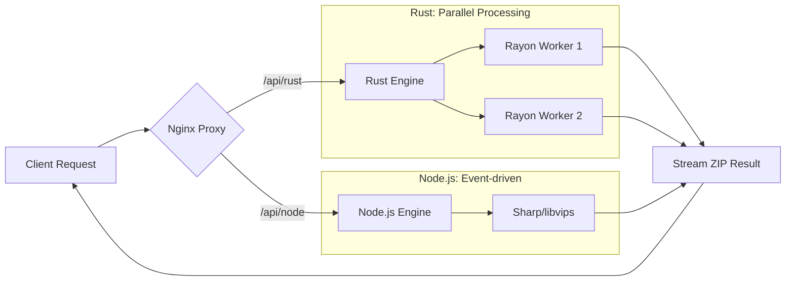

# 🚀 Rust-Image-Engine: High-Performance Image Processing Platform


## 🎯 1. Mục tiêu & Tầm nhìn (Vision)

Dự án được xây dựng để giải quyết bài toán xử lý ảnh khối lượng lớn với hiệu suất tối đa.
Mục tiêu cốt lõi là chứng minh sức mạnh của Rust trong việc thay thế các Runtime truyền thống (như Node.js) ở các tác vụ nặng về CPU.

- Ý nghĩa: Cung cấp giải pháp xử lý ảnh an toàn về bộ nhớ, tốc độ Native và khả năng mở rộng (Scale) linh hoạt.
- Định hướng: Phát triển thành một nền tảng Cross-platform (Desktop/Mobile) sử dụng chung một lõi Rust (Shared Core).

### 🌟 Key Features

- **Dual-Engine Processing**: Cho phép so sánh hiệu năng thực tế giữa Rust và Node.js.
- **High Performance**: Sử dụng Rayon (Rust) để xử lý ảnh song song và Sharp (Node.js) cho tốc độ tối đa.
- **Extreme Optimization**: Docker images siêu nhẹ (Rust ~33MB Content Size).
- **Robust Testing**: Bao phủ 100% các case quan trọng (Multiple files, Payload Too Large, Invalid Formats).
- **Observability**: Dashboard thời gian thực theo dõi CPU/RAM/Throughput.

## 🏗️ 2. Kiến trúc hệ thống



## 📊 3. Benchmark Results

Thực hiện bài test bằng k6 với cấu hình: 20 VUs, 30s duration.
Cả hai container được giới hạn tài nguyên tại 0.5 CPU và 256MB RAM.

| Metric                | Rust (Axum)      | Node.js (Fastify) | Winner         |
| --------------------- | ---------------- | ----------------- | -------------- |
| Throughput (Reqs/sec) | 5.90             | 3.84              | 🚀 Rust (+53%) |
| Avg Latency           | 3.22s            | 4.91s             | ⚡ Rust        |
| P(95) Latency         | 4.49s            | 5.99s             | 🛡️ Rust        |
| Memory Stability      | Extremely Stable | Fluctuating (GC)  | 💎 Rust        |

## 🛠 4. Tech Stack (Hệ sinh thái công nghệ)

| Thành phần       | Công nghệ sử dụng                       |
| ---------------- | --------------------------------------- |
| Frontend         | Next.js 14, TailwindCSS, TypeScript     |
| Core Engine      | Rust (Axum, Rayon, Image crate)         |
| Benchmark Target | Node.js (Fastify, Sharp, Archiver)      |
| Infrastructure   | Nginx, Docker, Docker Compose           |
| Testing          | Pytest(Integration test), k6(Load test) |
| Observability    | Prometheus, Grafana, cAdvisor           |
| CI/CD            | GitHub Actions                          |

## 📂 5. Cấu trúc thư mục (Project Structure)

```bash
├── backend-rust/ # Lõi xử lý ảnh tốc độ cao (Rust)
├── backend-node/ # Backend đối chứng (Node.js)
├── frontend/ # Giao diện người dùng (Next.js)
├── nginx/ # Cấu hình Reverse Proxy & Load Balancing
├── benchmarks/ # Báo cáo so sánh hiệu năng & biểu đồ
├── .github/workflows/ # Kịch bản CI/CD (Tự động build/test)
└── docker-compose.yml # Nhạc trưởng điều phối toàn bộ hệ thống
```

## 🔄 6. Luồng phát triển (Development Workflow)

1. Request: User upload danh sách ảnh từ Frontend.
2. Proxy: Nginx nhận request và điều phối sang Rust Backend qua đường dẫn /api/rust/.
3. Processing: Rust sử dụng Rayon để băm nhỏ dữ liệu, tận dụng tối đa các nhân CPU để resize ảnh song song.
4. Packaging: Kết quả được đóng gói thành file ZIP ngay trong RAM (không ghi đĩa để tăng tốc).
5. Response: Trả về stream dữ liệu cho người dùng.

## 🚀 7. Bắt đầu như thế nào? (Quick Start)

### 1. Requirements

- Docker & Docker Compose.
- Một file ảnh `test-photo.jpg` ở thư mục gốc.

### 2. Up and Running

Sử dụng Docker BuildKit để tối ưu hóa thời gian build:

```Bash
DOCKER_BUILDKIT=1 docker-compose up --build
```

### 3. Manual Test

- BE: trên Browser, truy cập `http://localhost/api/health` để check BE API
- FE: truy cập `http://localhost` để check FE Nextjs
  - click `Choose files` để chọn nhiều file ảnh
  - click `Gửi nhiều ảnh...` để gửi ảnh lên BE Service. BE sẽ nén từng ảnh và nén tệp ảnh thành 1 file ZIP. Rồi FE Nextjs down file ZIP đó về.
- Rust API: http://localhost/api/rust/process
- Node API: http://localhost/api/node/process
- Grafana Dashboard: http://localhost:3000 (admin/admin)

### 4. Running Integration Tests

Kiểm tra tính đúng đắn của luồng dữ liệu thông qua container Tester:

```Bash
docker-compose run --rm tester
```

### 5. Running Load Test (k6)

```Bash
# 1. Modify to `/api/rust/process` or `/api/node/process` in script.js
# 2.(a) Linux, Mac
docker run --rm --add-host=host.docker.internal:host-gateway -v $(pwd):/home/k6 -i grafana/k6 run /home/k6/script.js
# 2.(b) Windows
```

### 6. (Optional) Manually test local

```bash
# 1 terminal run BE Rust
cd backend && cargo run
# 1 terminal run FE Nextjs
cd frontend && npm run dev

# Manual test: access http://localhost:8080/api/health to check BE
# Manual test: access http://localhost:3000/ to check FE

# 1 terminal Integration-Test: install uv manager for Python
uv sync
uv run pytest tests
```

## 📈 8. Tổng kết

> "Rust xử lý nhanh hơn Node.js 1.5x trong điều kiện 20 requests đồng thời,
> mức chiếm dụng RAM thấp hơn 4x."

```plaintext
Performance Comparison (Throughput - Reqs/sec)
--------------------------------------------
Rust:   ███████████████████████████ 5.90 reqs/s
Node:   ██████████████ 3.84 reqs/s
--------------------------------------------
```

%27,%27Avg%20Latency%20(s)%27],datasets:[{label:%27Rust%27,data:[5.9,3.22]},{label:%27Node.js%27,data:[3.84,4.91]}]}}>)

## 🧠 Critical Decisions

Trong quá trình phát triển, tôi đã đưa ra các quyết định kỹ thuật quan trọng để cân bằng giữa hiệu suất và khả năng bảo trì:

- **Sử dụng cargo-chef cho Rust Docker**: \* _Vấn đề_: Build Rust rất chậm vì phải tải lại hàng trăm crate mỗi lần sửa 1 dòng code.
  - _Giải pháp_: Tách riêng bước build dependencies sang một layer riêng. Kết quả: Giảm thời gian build CI từ 10-12 phút xuống còn < 2 phút.
- **Next.js Standalone Output**: \* _Quyết định_: Không copy toàn bộ node_modules vào production image.
  - _Kết quả_: Giảm dung lượng Frontend Image từ ~1.2GB xuống còn ~380MB, chỉ giữ lại những file cần thiết cho server-side execution.
- **Nginx làm Buffer & Gateway**: \* _Quyết định_: Đặt Nginx đứng trước để xử lý các vấn đề "vặt" như client_max_body_size và chuẩn hóa API route.
  - _Lợi ích_: Backend (Rust/Node) có thể tập trung hoàn toàn vào xử lý ảnh mà không cần quan tâm đến các cấu hình hạ tầng phức tạp.

## 📝 Key Learnings

**Memory Management**: Rust không có Garbage Collector giúp tài nguyên RAM luôn ổn định dưới tải cao, trong khi Node.js dễ bị nghẽn (bottleneck) khi GC hoạt động để dọn dẹp các Buffer ảnh lớn.

**Parallelism**: Nhờ Rayon, Rust tận dụng tối đa 0.5 CPU để xử lý tính toán song song hiệu quả hơn cơ chế Event Loop kết hợp worker pool của Node.js.

**Scalability**: Kiến trúc sử dụng Nginx làm Reverse Proxy giúp việc mở rộng (Horizontal Scaling) các instance Backend trở nên dễ dàng.

## 🧬 Others

### 📊 Service Optimization

Đây là kết quả của quá trình tối ưu hóa Multi-stage Build và Standalone Mode:

| Service          | Trước Tối Ưu | Sau Tối Ưu | Content Size | Hiệu quả |
| ---------------- | ------------ | ---------- | ------------ | -------- |
| Rust Backend     | 1.51 GB      | 135 MB     | 33.9 MB      | ↓ 91%    |
| Node.js Backend  | 1.23 GB      | 372 MB     | 89.9 MB      | ↓ 70%    |
| Next.js Frontend | 1.19 GB      | 389 MB     | 94.0 MB      | ↓ 67%    |

**Insight**: Rust đạt mức tiêu thụ tài nguyên cực thấp và ổn định (O(1) Memory footprint),
trong khi Node.js có biến động "răng cưa" do cơ chế Garbage Collection.

### 🛡 Quality Assurance

Hệ thống áp dụng chiến lược **Test-Driven Development (TDD)** với pipeline tự động:

- **CI/CD Pipeline**: Tự động hóa build-test-lint trên mỗi lượt Pull Request bằng **GitHub Actions**.
- **Unit Tests**: Rust (Cargo test) & Node.js (Jest/Tap) đảm bảo logic xử lý ảnh và nén ZIP luôn chính xác.
- **Integration Tests**: Sử dụng **Pytest + Requests** để verify luồng đi của dữ liệu qua Nginx.
  - **test_load_balancing**: Kiểm tra khả năng điều phối của Gateway. ✅
  - **test_error_handling**: Đảm bảo mã lỗi chuẩn RESTful (400, 413, 415, 502). ✅
  - **test_multiple_files**: Pass ✅
  - **test_file_too_large** (413): Pass ✅
  - **test_invalid_file_type** (400): Pass ✅
- **Load Testing**: Sử dụng **k6** giả lập 100+ người dùng đồng thời để tìm ra điểm gãy (Breaking point) của hệ thống.

## 👤 Author

Michael

LinkedIn: linkedin.com/in/...

Portfolio: ....com

---

Created with ❤️ by Gemini & Michael
